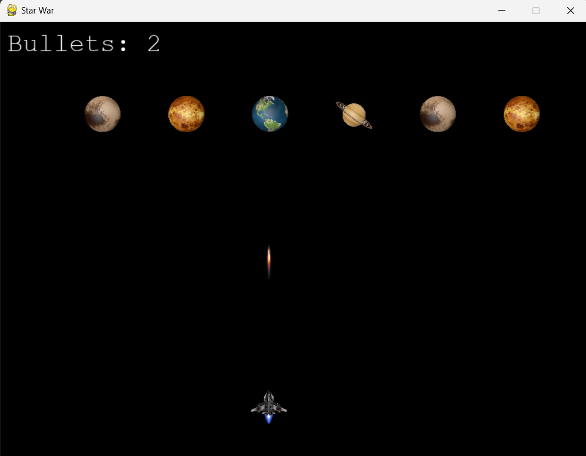
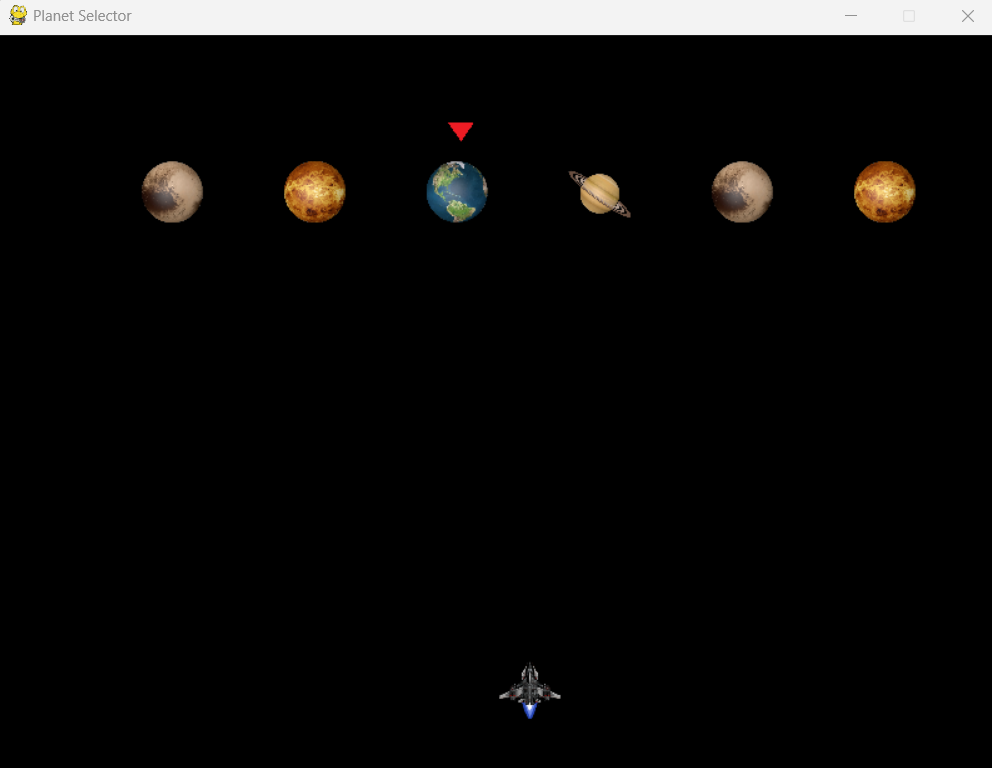

# StarWar Multiplayer Game

StarWar is an exciting multiplayer game developed using Python, Pygame, and Socket programming. One player acts as the server and controls an aircraft, trying to guess and shoot the planet selected by the client. The client simply selects a planet and tries to avoid detection.


## Table of Contents
- [Features](#features)
- [Requirements](#requirements)
- [Installation](#installation)
- [Usage](#usage)
  - [Server Instructions](#server-instructions)
  - [Client Instructions](#client-instructions)
- [Gameplay](#gameplay)
- [File Structure](#file-structure)
- [Screenshots](#screenshots)
- [Credits](#credits)

## Features
- Multiplayer gameplay over sockets
- GUI for selecting roles (server or client)
- Sound effects for shooting, winning, and losing
- Interactive and animated graphics
- Simple and engaging gameplay mechanics

## Requirements
- Python 3.x
- Pygame
- Tkinter

## Installation
1. Clone the repository:
    ```sh
    git clone https://github.com/your-username/StarWar-Multiplayer-Python-Pygame-Over-Socket-Game.git
    ```
2. Navigate to the project directory:
    ```sh
    cd StarWar-Multiplayer-Python-Pygame-Over-Socket-Game
    ```
3. Install the required packages:
    ```sh
    pip install pygame
    pip install tkinter
    ```

## Usage
1. Run the `gui.py` script to start the game:
    ```sh
    python gui.py
    ```

2. Choose whether to be the server (aircraft) or the client (planet).

### Server Instructions
- As the server, you control the aircraft.
- Use the left and right arrow keys to move the aircraft.
- Press the space bar to shoot bullets at the planets.
- Try to guess and shoot the planet selected by the client.

### Client Instructions
- As the client, you simply select a planet.
- Click on the desired planet to select it.
- Pray that your planet is n getting hit by the server's aircraft.

## Gameplay
- The server player shoots bullets at the planets.
- If the server hits the selected planet, the server wins.
- If the server runs out of bullets without hitting the selected planet, the client wins.
- The game displays a win/lose message based on the outcome.

## File Structure
- `gui.py`: Contains the GUI for selecting the server or client role.
- `server.py`: Contains the server logic and game loop for the aircraft player.
- `client.py`: Contains the client logic for the planet player.
- `images/`: Directory containing image assets for the game.
- `sound/`: Directory containing sound assets for the game.

## Screenshots


### Server Gameplay


### Client Gameplay



## Credits
- Developed by Mohamed Eid
